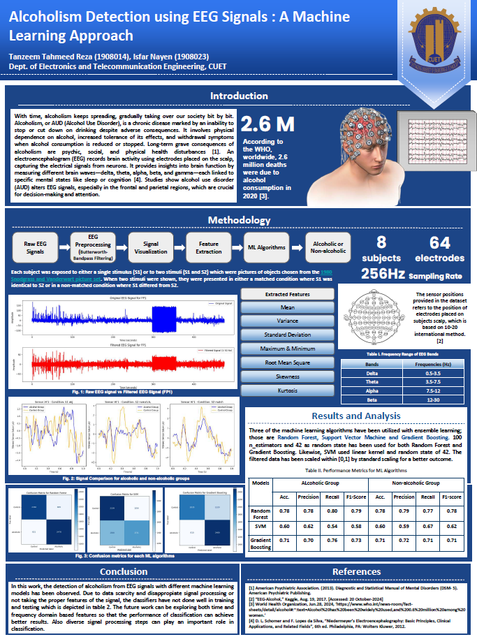
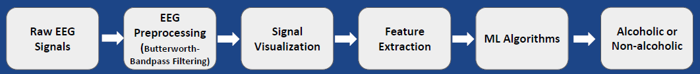
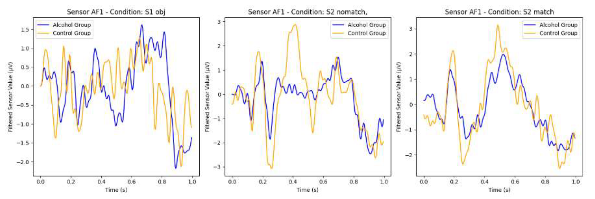
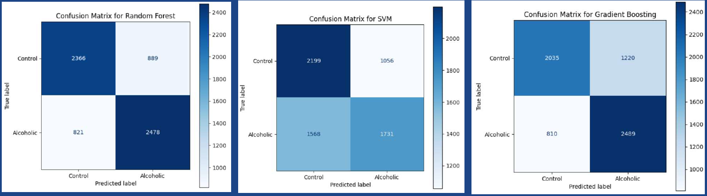

# EEG signal for alcoholic and Non-Alcoholic/Controlled group
EEG Data Processing and Model Prediction Notebook

- Converts EEG data to CSV format for easier analysis.
- Implements preprocessing steps for EEG signals.
- Loads a trained machine learning model for predictions.
- Performs evaluation and visualization of model results.

This notebook is essential for automating EEG data handling and predictive analysis.

 
    
 

<h2>Introduction:</h2>

- With time, alcoholism continues to spread, gradually affecting our society bit by bit. Alcoholism, or Alcohol Use Disorder (AUD), is a chronic disease characterized by an inability to stop or reduce alcohol consumption despite adverse consequences. It involves physical dependence on alcohol, increased tolerance to its effects, and withdrawal symptoms when consumption is reduced or stopped. The long-term consequences of alcoholism include psychological, social, and physical health disturbances.

- An electroencephalogram (EEG) records brain activity using electrodes placed on the scalp, capturing electrical signals from neurons. It provides insights into brain function by measuring different brain waves—delta, theta, alpha, beta, and gamma—each linked to specific mental states such as sleep or cognition. Studies have shown that Alcohol Use Disorder (AUD) alters EEG signals, particularly in the frontal and parietal regions, which are crucial for decision-making and attention.

<h2>Methodology:</h2>

 
    
 

<h2>Performance Test:</h2>

This section presents three graphical analyses of EEG responses:  
1. **Stimulus Response:** The first graph illustrates EEG samples collected from both the controlled and alcoholic groups as they were shown images of various objects.  
2. **No-Matching Condition:** The second graph highlights a cognitive task where participants identified whether objects were the same. The controlled group performed well, whereas the alcoholic group struggled in non-matching conditions.  
3. **Matching Condition:** The third graph demonstrates that both groups performed similarly when the objects matched. 
 
    
 

<h2> Result and Analysis: </h2>

Three of the machine learning algorithms have been utilized with ensemble learning those are Random Forest, Support Vector Machine and Gradient Boosting 100 n_estimators and 42 as random state has been used for both Random Forest and Gradient Boosting Likewise, SVM used linear kernel and random state of 42 The filtered data has been scaled within 0 1 by standard scaling for a better outcome.

**Accuracy table:**

|Models| | Alcoholic | Group | | | Non-Alcoholic | Group | |
|-|-|-|-|-|-|-|-|-|
| | Acc.       | Precision  | Recall     | F1-Score   | Acc.       | Precision  | Recall     | F1-Score   |
| Random Forest   | 0.78       | 0.78       | 0.80       | 0.79       | 0.78       | 0.79       | 0.77       | 0.78       |
| SVM            | 0.60       | 0.62       | 0.54       | 0.58       | 0.60       | 0.59       | 0.67       | 0.62       |
| Gradient Boosting | 0.71    | 0.70       | 0.76       | 0.73       | 0.71       | 0.72       | 0.71       | 0.71       |

**Confusion Matrics for each ML algorithm:**

 
    
 

The confusion matrices of three algorithms—Random Forest, SVM, and Gradient Boosting—are presented below:

- Random Forest misclassified 889 controlled individuals and 821 alcoholic individuals out of a total of 3,299 people.
- SVM had a higher misclassification rate, incorrectly identifying 1,056 controlled individuals and 1,568 alcoholic individuals within the same dataset.
- Gradient Boosting performed similarly to Random Forest, with 889 misclassified controlled individuals and 810 misclassified alcoholic individuals among 3,299 people.

This comparison highlights the varying performance of the models in distinguishing between the two groups.
